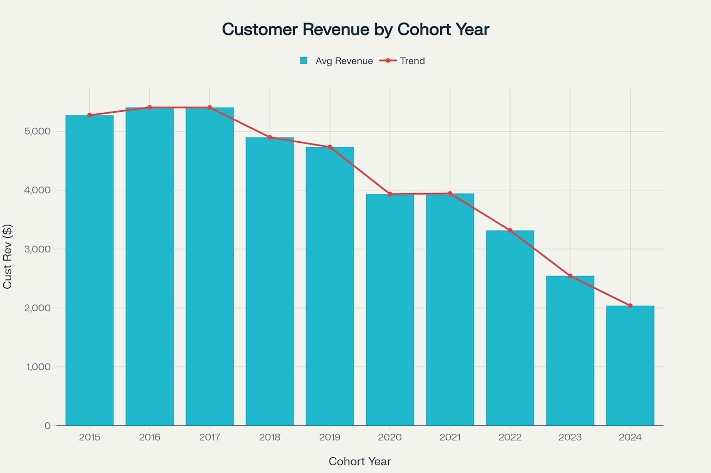

# Intermediate SQL - Sales Analysis

## Overview
Analysis of  customer behavior, retention, and lifetime value for an e-commerce company to improve customer retention and maximize revenue.

## Business Questions
1. **Customer Segmentation:** Who are our most valuable customers?
2. **Cohoer Analysis:** How do different customer groups generate revenue?
3. **Retention Analysis:** Which customers haven`t purchased recently?

## Clean up Data

**🖥️ Query**: [0_creat_view.sql](0_creat_view.sql)

- Aggregated sales and customers data into revenue metrics
- Calculated first purchase dates for cohort analysis
- Created view combinig transactions and customer details

## Analysis

### 1. Customer Segmentation

**🖥️ Query**: [1_customer_segmentation.sql](1_customer_segemntation.sql)

- categorized customers based on total lifetime value (LTV)
- Assigned customers to High, Mid, Low-value segments
- Calculated key metrics like total revenue

**📈 Visualization:**

📊 **Key findings:** 
- High-value segment (25% of customers) drive 66% of revenue ($135.4M)
- Mid-value segemnt (50% of customers) generate 32% of revenue ($66.6M)
- Low-value segemnt (25% of customers) account for 2% of revenue ($4.3M)

💡 **Business Insights**
- High-value segment (66% revenue): Offer premium membership program to 12,372 VIP customers, as losing one customer significantly impacts revenue
- Mid-value segemnt (32% revenue): create upgrade paths through personalized promotions, with potential $66.6M ➡️ $135.4M revenue opportunity
- Low-value segemnt (2% revenue): design re-engagement campaigns and price-sensitive promotions to increase purchase frequency

### 2. Customer Revenue by Cohort
**🖥️ Query**: [2_cohort_analysis.sql](2_cohort_analysis.sql)

- Tracked revenue and costumers count per cohorts
- Cohorts were grouped by year of first purchase
- Analyzed customer revenue at a cohort level

**📈 visualization:**
Customer Revenue by Cohort (Adjusted for time in market) - first pucrhase date

Inverigate Monthly & Customer trends (3 Months Rolling Average)

📊**Key Findings:**
-Customer revenue is declining, older cohorts (2016-2018) spent ~$2,800+, while 2024 cohort spending  dropped tp ~$1,970.
-Revenue and customers peaked in 2022-2023, but both are now trending downward in 2024.
- High volatility in revenue and customer count, with sharp drops in 2020 and 2024, signaling retention challenges.

💡**Business Insights:**
- Boost retention & re-engagement by targeting recentcohorts (2022-2024) with personalized offers to prevent churn.
- Stabilize revenue fluctuations and introduce loyalty programs or subscriptions to ensure consistent spending.
-Investigate cohort differnces by applying successful startegies from high-spending cohorts (2016-2018) to newer ones.

### 3.Customer Retention 
🖥️ Query: [3_retention_analysis](3_retention_analysis.sql)

- Identified customers at risk of churning
- Analyzed last purchase patterns
= calculated customer-specfifc metrics 

**📈 Visulaization:**

📊 **Key Findings:**
- Cohort churn stabilizes at ~90% after 2-3 years, indicating a predictable long-term retention pattern.
- Retention rates are consistently low (8-10%) across all cohorts, suggesting retention errors are systmic rather than specific to certain years.
- Newer cohorts (2022-2023) show similar churn trajectories, signaling that without intervention, future cohorts will follow the same patterns.

💡 **Business Insights:**
- strenghten early engagement startegies to target the first 1-2 years with onboarding incentives, loyalty rewards, and oersonalized offers to improvelong-term retention.
- Re-engage high-value churned customers by focusing on targeted win-back campaings rather than board retention efforts, as reactivating valuable users may yield higher ROI.

## strategic Recommendations

1. **Customer Value Optimization** (customer segmentation)
    - Launch VIP program for 12,372 High-Vlaue customers (66% Revenue)
    - Create persoanlized upgrade paths for Mid-Value segment ($66.6M ➡️ $135.4M opportunity)
    - design price-sensitive promotions for Low-Value segement to increase frequency

2. **Cohort Preformance startegy** (customer Revenue by Cohort)
    - Taregt 2022-2024 cohorts with personalized re-engagement offers
    - Implement loyalty / subscription programs to stabilize revenue fluctuations
    - Apply successful strategies from High-Spending 2016-2018 cohorts to newer customers

3. **Retention & Churn Prevention** (Customer Retention)
    - Strenghten first 1-2 year engagement with onboarding oncentive and loyalty rewards
    - focus on trageted win-back campaings for High-Value churned customers
    - implement proacive intervention system for at-risk customers before they laps.

## Technical Details 

- **Database:** PostgreSQL
- **Analysis Tools:** PostgreSQL, Dbeaver
- **Visualization:** ChatGPT
